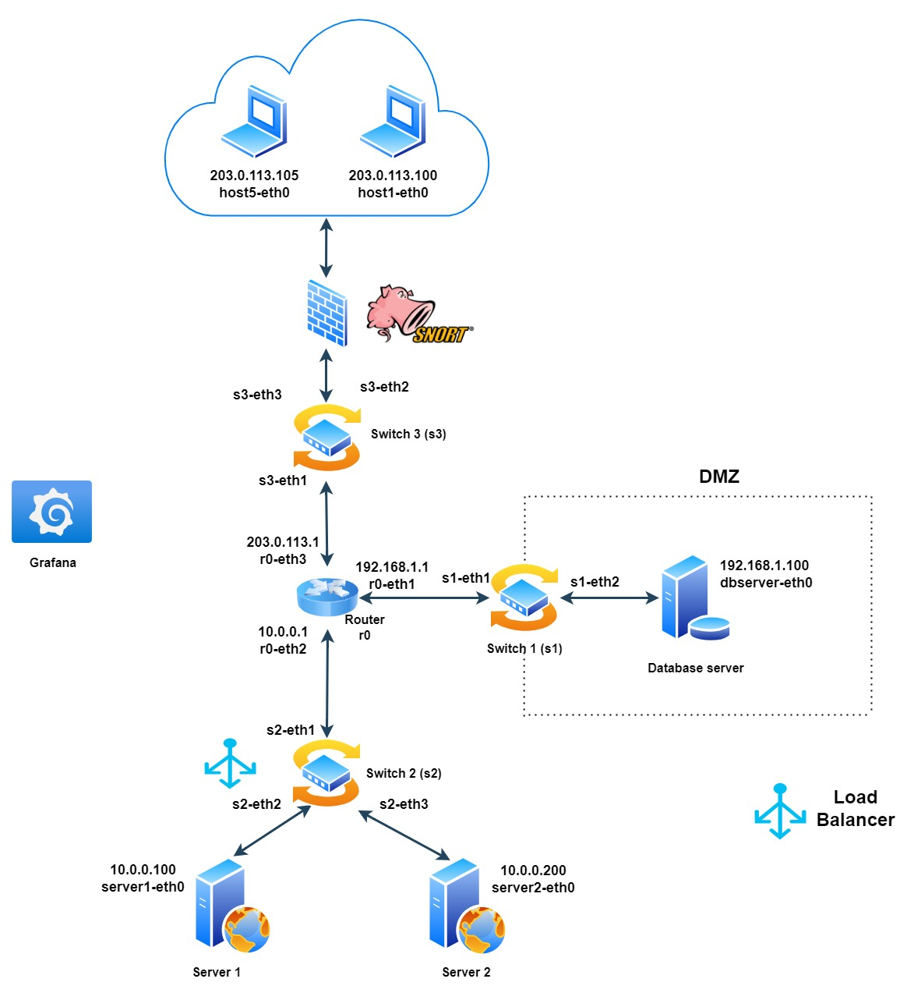

# SDN_Project


## Overview
This project focuses on the creation and management of a software-defined network (SDN) using Mininet and the Ryu controller. It includes the implementation of several key functionalities such as load balancing, firewall and network monitoring. In addition, it integrates with tools such as Snort for intrusion detection and Grafana for visualisation of performance metrics.

## Quick Start

To get the project up and running, follow these steps in four separate terminals:

### Terminal 1:
1. Start the Ryu controllers and other components:
    ```sh
    sudo ryu-manager ryu/simple_switch_snort.py ryu/rest_firewall.py loadbalancer/load_balancer.py grafana/simple_monitor_13_telegraf.py
    ```


### Terminal 2:
1. Initialize the environment:
    ```sh
    ./initialize.sh
    ```
2. Run the Mininet topology:
    ```sh
    sudo python2 macTopology.py
    ```

### Terminal 3:
1. Apply the firewall rules:
    ```sh
    ./rules_firewall.sh
    ```

### Terminal 4:
1. Configure and start Snort:
    ```sh
    ./snort/auto_snort.sh
    ```

These commands will initialize and run all the necessary components for the project. Make sure to execute each set of commands in the specified order and terminals.


## Project Structure

This project includes a variety of directories and files, each with a specific purpose. Below is a description of each:

### Directories:

- `docu/` - This directory contains doc files.
- `grafana/` - This folder contains scripts and configurations related to the integration of Grafana and Telegraf for network monitoring.
- `loadbalancer/` - This folder contains scripts related to the implementation and testing of a load balancer on the simulated network.
- `ryu/` - This folder contains scripts related to the Ryu driver, which is used to manage and control the Software Defined Network (SDN).
- `snort/` - This folder contains scripts and configuration files related to the integration of Snort, an intrusion detection system (IDS), into the simulated network.

### Files:

- `initialize.sh` - A shell script that sets up the environment and cleans.
- `macTopology.py` - This file defines the structure of the network simulated in Mininet, including the switches, hosts and links needed for testing and development of network applications.
- `rules_firewall.sh` - This file contains the firewall rules that apply to the network, defining security policies to control traffic and protect the network infrastructure.
- `requirements.txt` - This file lists all the Python dependencies and packages needed to run the project's scripts and applications..
- `simple_monitor_13_telegraf.py` - A Python script designed to collect network metrics using Telegraf and visualise them in Grafana. This script allows monitoring different aspects of the network simulated in Mininet, providing a visual interface to analyse network performance and stability.
- `load_balancer.py` - A Python script that implements load balancer logic, distributing network traffic across multiple servers to optimise performance and availability.
- `rest_firewall.py` - A script that implements a firewall using Ryu. It allows to define and apply firewall rules through a REST API.
- `simple_switch_snort.py` - A script that integrates Snort, an intrusion detection system (IDS), with a simple level 2 switch in Ryu.


## Collaborators 
* Dand Marbà Sera
* Alex Romano Molar
* Oriol Miranda Garrido 